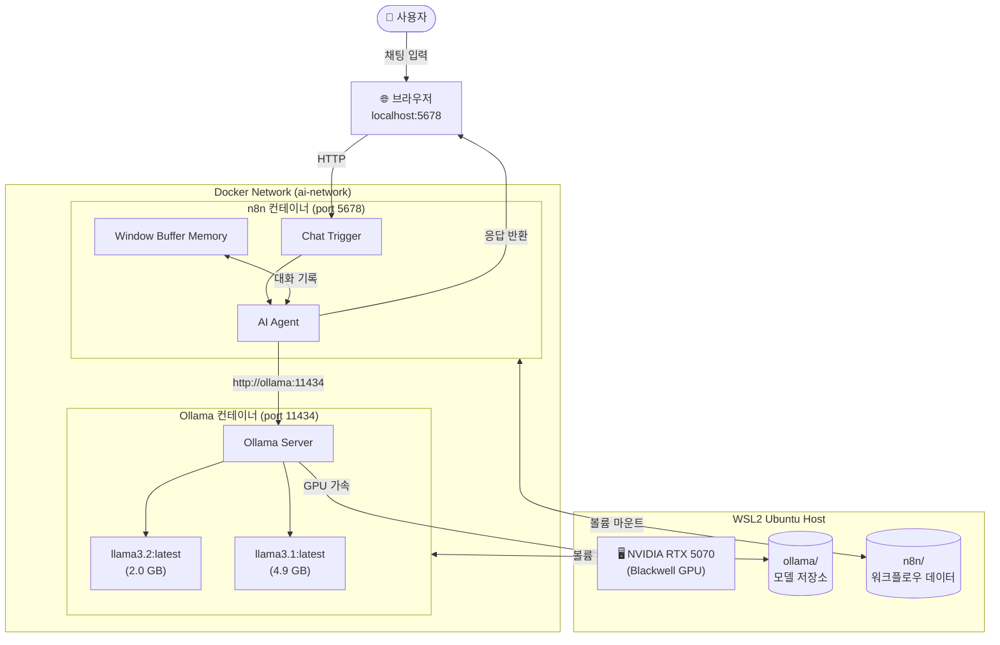

# Local AI Chatbot — Ollama + n8n

WSL2 Ubuntu 환경에서 Docker를 사용해 **Ollama**와 **n8n**을 연동한 로컬 AI 챗봇 프로젝트입니다.
인터넷 연결 없이 NVIDIA GPU를 활용해 LLM 모델을 로컬에서 실행하고, n8n 워크플로우로 챗봇을 구현합니다.

---

## 아키텍처



---

## 기술 스택

| 구성 요소 | 버전 | 설명 |
|---|---|---|
| OS | Ubuntu 24.04 (WSL2) | Windows 11 위에서 실행 |
| GPU | NVIDIA RTX 5070 | Blackwell 아키텍처 |
| CUDA | 12.8 | GPU 컴퓨팅 |
| Docker Engine | 29.4.0 | 컨테이너 런타임 |
| NVIDIA Container Toolkit | 1.19.0 | Docker GPU 연동 |
| Ollama | latest | LLM 로컬 실행 엔진 |
| n8n | latest | 워크플로우 자동화 |

---

## 사용 모델

| 모델 | 크기 | 특징 |
|---|---|---|
| llama3.2:latest | 2.0 GB | 빠른 응답, 경량 |
| llama3.1:latest | 4.9 GB | 높은 정확도 |

---

## 실행 방법

### 1. 서비스 시작

```bash
docker compose up -d
```

### 2. 모델 pull

```bash
docker exec ollama ollama pull llama3.2
docker exec ollama ollama pull llama3.1
```

### 3. n8n 접속

브라우저에서 `http://localhost:5678` 접속 후 워크플로우 활성화

---

## 폴더 구조

```
local-ai-chatbot/
├── docker-compose.yaml   # 서비스 정의
├── .env.example          # 환경변수 샘플
├── .gitignore
└── README.md
```

---

## 환경변수 설정

`.env.example`을 복사해 `.env` 파일 생성:

```bash
cp .env.example .env
```
