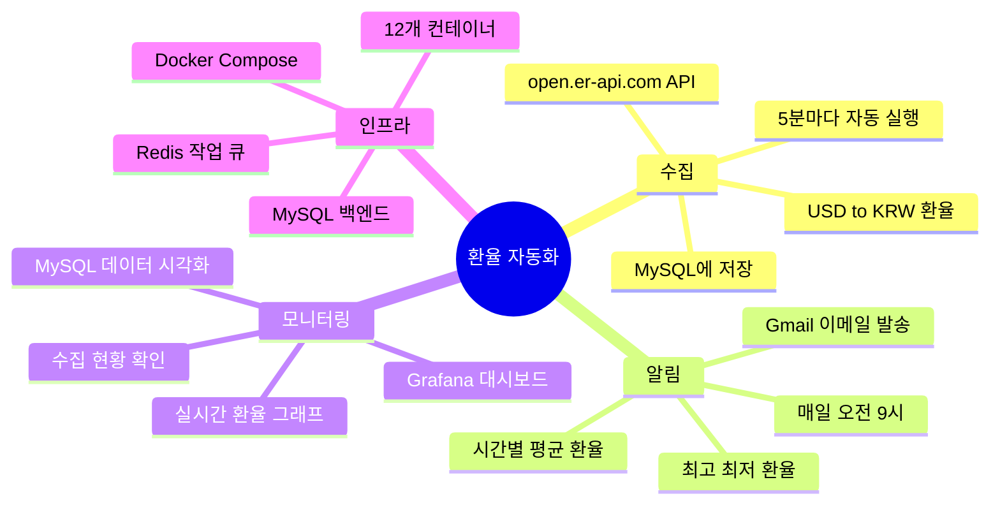
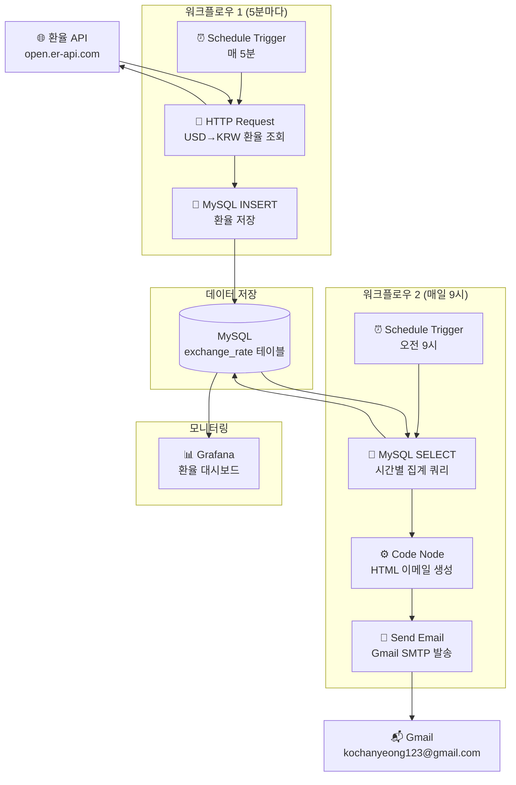
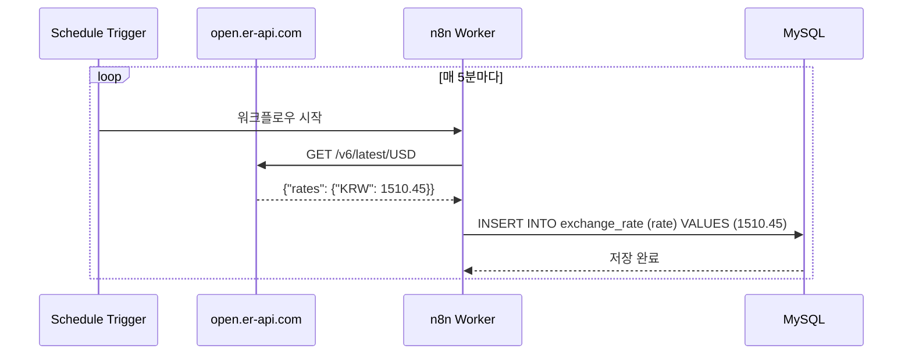
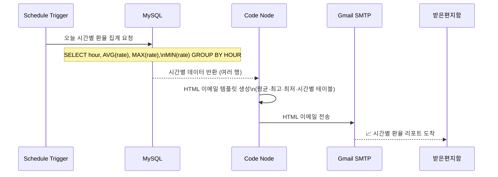
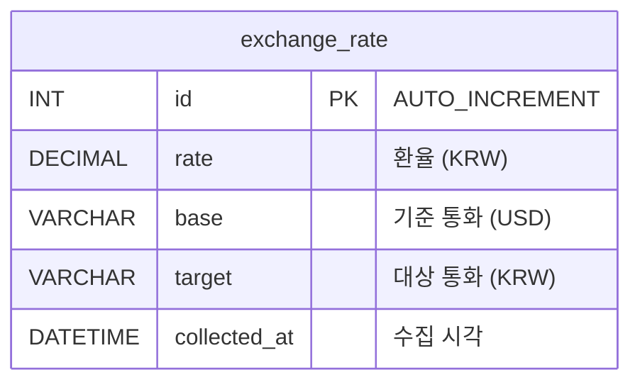
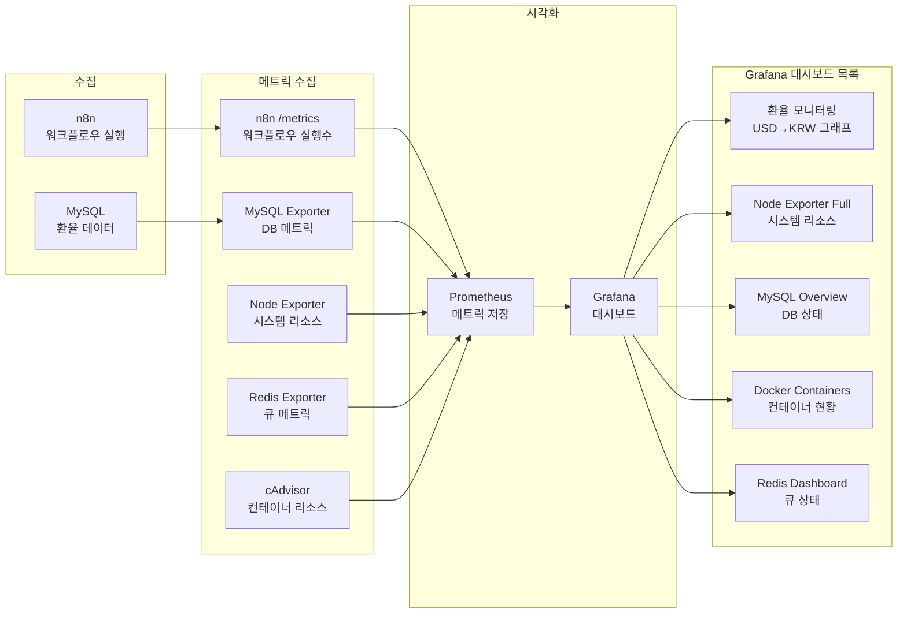
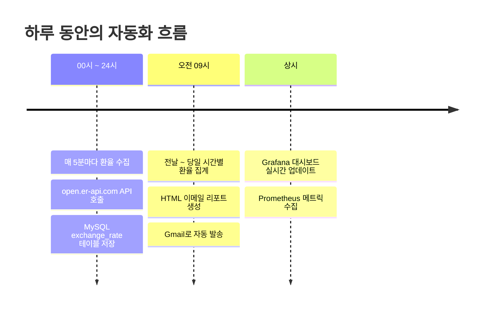
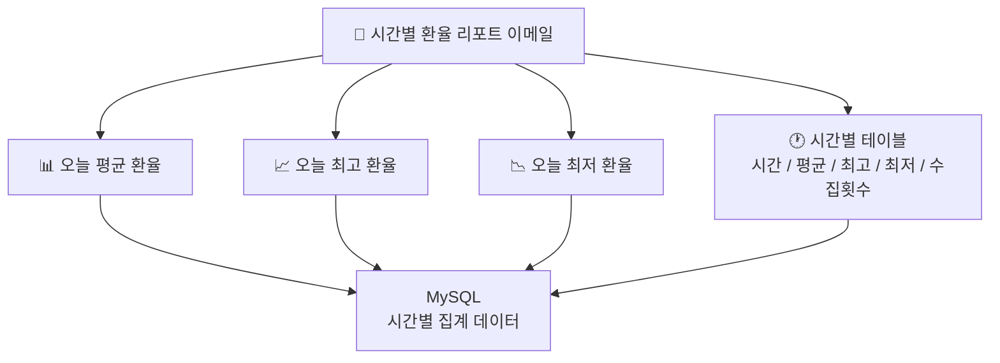

# 환율 자동화 프로젝트

n8n + MySQL + Grafana를 Docker로 컨테이너화하여 USD→KRW 환율을 자동 수집하고, 매일 아침 이메일로 시간별 리포트를 발송하는 자동화 시스템입니다.

---

## 목차

- [프로젝트 개요](#프로젝트-개요)
- [전체 시스템 흐름](#전체-시스템-흐름)
- [워크플로우 1 — 환율 수집](#워크플로우-1--환율-수집-5분마다)
- [워크플로우 2 — 이메일 발송](#워크플로우-2--이메일-발송-매일-9시)
- [데이터 저장 구조](#데이터-저장-구조)
- [모니터링 흐름](#모니터링-흐름)
- [기능 요약](#기능-요약)
- [접속 정보](#접속-정보)
- [관리 명령어](#관리-명령어)

---

## 프로젝트 개요



---

## 전체 시스템 흐름



---

## 워크플로우 1 — 환율 수집 (5분마다)



---

## 워크플로우 2 — 이메일 발송 (매일 9시)



---

## 데이터 저장 구조



**수집 주기**: 5분마다
**보존 기간**: 무제한 (디스크 용량 한도)
**집계 방식**: 시간별 AVG / MAX / MIN

---

## 모니터링 흐름



---

## 기능 요약



---

## 이메일 리포트 구성



---

## 접속 정보

| 서비스 | URL | 계정 | 비밀번호 |
|---|---|---|---|
| 🌐 랜딩 대시보드 | http://localhost:8888 | — | — |
| ⚡ n8n | http://localhost:5678 | — | — |
| 📊 Grafana | http://localhost:3001 | `admin` | `7345` |
| 🗄️ Adminer | http://localhost:8080 | `root` | `7345` |
| 🔥 Prometheus | http://localhost:9090 | — | — |
| 🐬 MySQL | `localhost:3307` | `root` | `7345` |

---

## 관리 명령어

```bash
make up          # 전체 스택 시작
make down        # 전체 스택 중지
make ps          # 컨테이너 상태 확인
make logs        # 전체 로그 (실시간)
make logs-n8n    # n8n 로그만
make logs-mysql  # MySQL 로그만
make mysql       # MySQL CLI 접속
make clean       # 컨테이너 삭제 (데이터 유지)
make clean-all   # 전체 삭제 (데이터 포함, 주의!)
```
